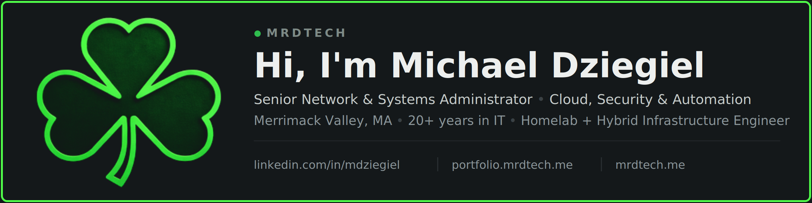

---

  
  

## 👨‍💻 About Me
- 20+ years managing and securing hybrid infrastructure with a focus on Cloud, Security & Automation  
- Expertise in Network Management, Virtualization, and Endpoint Engineering  
- Building scalable, secure, repeatable solutions across enterprise + homelab  
- Automating infrastructure and workflows with PowerShell, Microsoft Graph, GitHub Actions, and n8n  
- Building intelligent automation using AI Agents, MCP Servers, RAG, and Hermes  
- Always experimenting with Zero Trust, monitoring, and self-hosted platforms  
- Running hybrid self-hosted and cloud infrastructure across on-premises and cloud platforms  
- Available for remote, consulting, freelance, and contract IT opportunities  

## 🧰 Tech & Tools I Use

**Infrastructure:** Proxmox · QNAP · Hyper-V · UniFi · pfSense · OPNsense · Proxmox Backup Server · Veeam · Backblaze B2 · Meraki · Cisco  
**OS:** Windows Server · Ubuntu Server · Debian · Linux  
**Containers:** Docker · Compose · Portainer  
**Cloud:** Azure · Microsoft 365 · Intune · Autopilot · Entra ID  
**Automation:** PowerShell · Graph API · GitHub/GitLab CI · n8n · AI Agents · MCP · RAG  
**Networking:** VLAN Design · WireGuard/Tailscale · Nginx Reverse Proxy/WAF · Cloudflare Tunnels · Fing  
**Self-Hosted:** AdGuard · Home Assistant · RustDesk · Uptime Kuma · Pi.Alert · LinkStack · Seafile · UrBackup · Seerr · Bitwarden  
**Security:** Wazuh · Cloudflare Zero Trust · UniFi IDS/IPS · pfSense Firewall · T-Pot  
**Enterprise:** ConnectWise · ScreenConnect · Auvik · Sophos · Proofpoint · Microsoft Defender · Cisco Umbrella · KnowBe4 · Meraki  

  
  
  
  
  
  
  
  
  
  
  
  
  
  

## 📂 Projects

### 🏠 Homelab & Infrastructure
- **[NOC Dashboard](https://github.com/mdziegiel/noc-dashboard)** — Self-hosted Network Operations Center for homelab infrastructure: Proxmox VMs, Docker containers, UPS status, and backup coverage `FastAPI` `React` `Docker`
- **[SIEM + CrowdSec Detection](https://github.com/mdziegiel/siem-crowdsec-detection)** — Wazuh SIEM custom detection rules and CrowdSec bouncer configs across a multi-host homelab, with OpenCanary honeypot integration `Wazuh` `CrowdSec` `Security`
- **[Prometheus + Grafana Alerting (n8n)](https://github.com/mdziegiel/prometheus-n8n-alerting)** — Self-hosted homelab observability — Prometheus + Grafana + node_exporter + cAdvisor across multiple Docker hosts, with alerting via n8n polling the Prometheus API into Telegram (no Alertmanager required) `Prometheus` `Grafana` `n8n`
- **[Uptime Kuma Monitoring](https://github.com/mdziegiel/uptime-kuma-monitoring)** — Uptime monitoring and alerting stack for all homelab services `Docker` `Cloudflare Tunnel`
- **[AdGuard + Unbound Stack](https://github.com/mdziegiel/adguard-unbound-stack)** — Redundant network-wide DNS filtering with recursive resolution and centralized sync `DNS` `Docker`

### 🤖 AI, Automation & Integrations
- **[Vault RAG Pipeline](https://github.com/mdziegiel/vault-rag-pipeline)** — Self-hosted RAG pipeline for an AI homelab agent — semantic search over an Obsidian vault with automated secrets/IP redaction before embedding, Qdrant + Ollama (nomic-embed-text) + gitleaks `Qdrant` `Ollama` `RAG` `Python`
- **[Multi-Server MCP Gateway](https://github.com/mdziegiel/mrdtech-mcp-gateway)** — Hardened, read-only MCP gateway exposing Portainer, GitHub, Filesystem, Proxmox, PBS, and Vault RAG visibility to an AI agent — loopback-only, SSH-tunneled, zero client-side credentials `MCP` `Docker` `Security` `Python`
- **[n8n Self-Healing Infrastructure](https://github.com/mdziegiel/n8n-self-healing-infra)** — Automated VM/container recovery, backup-failure alerting, and SIEM event routing to Telegram `n8n` `Proxmox` `CrowdSec`
- **[Job Watch](https://github.com/mdziegiel/job-watch)** — Job-search aggregator with AI match scoring and per-listing alerting `Python` `RapidAPI` `Telegram`
- **[Obsidian Vault Setup](https://github.com/mdziegiel/obsidian-vault-setup)** — Personal knowledge base built on Obsidian, structured as long-term memory for a self-hosted AI agent — RAG-indexed, auto-logged, secrets-redacted before embedding `Obsidian` `Knowledge Base`

### 🛠️ Tools & Remote Access
- **[System Tools Suite](https://github.com/mdziegiel/system-tools-suite)** — Sysadmin and security toolkit: network diagnostics, DevOps helpers, digital forensics `Docker`
- **[RustDesk Self-Hosted](https://github.com/mdziegiel/rustdesk-self-hosted)** — Fully self-hosted remote desktop replacing TeamViewer/AnyDesk `Docker` `Linode`
- **[Exam Prep](https://github.com/mdziegiel/exam-prep)** — AI-powered IT certification prep with spaced repetition and timed exams (MD-102, AZ-104, CompTIA) `Python` `AI`

## 📊 GitHub Stats

  

## 🌍 Connect with Me

- 🌐 **Portfolio:** https://portfolio.mrdtech.me  
- 💼 **LinkedIn:** https://www.linkedin.com/in/michaeldziegiel  
- 🖥️ **Website:** https://mrdtech.me  
- 📧 **Email:** techgeek@mrdtech.me  

👁️ Profile views: 

⭐ *Always building, improving, and securing IT environments — one project at a time.*
